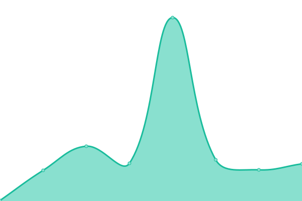

# [📈 Live Status](https://DimensionDev.github.io/Firefly_service_status): <!--live status--> **🟧 Partial outage**

This repository contains the open-source uptime monitor and status page for [Dimension](https://dimension.im), powered by [Upptime](https://github.com/upptime/upptime).

With [Upptime](https://upptime.js.org), you can get your own unlimited and free uptime monitor and status page, powered entirely by a GitHub repository. We use [Issues](https://github.com/DimensionDev/Firefly_service_status/issues) as incident reports, [Actions](https://github.com/DimensionDev/Firefly_service_status/actions) as uptime monitors, and [Pages](https://DimensionDev.github.io/Firefly_service_status) for the status page.

<!--start: status pages-->
<!-- This summary is generated by Upptime (https://github.com/upptime/upptime) -->
<!-- Do not edit this manually, your changes will be overwritten -->
<!-- prettier-ignore -->
| URL | Status | History | Response Time | Uptime |
| --- | ------ | ------- | ------------- | ------ |
|  [Google](https://www.google.com) | 🟥 Down | [google.yml](https://github.com/DimensionDev/Firefly_service_status/commits/HEAD/history/google.yml) | 

 0ms
     
 | 

<a href="https://DimensionDev.github.io/Firefly_service_status/history/google">100.00%</a>
    

|  [Firefly-API (DEV)](https://api-dev.firefly.land/) | 🟩 Up | [firefly-api-dev.yml](https://github.com/DimensionDev/Firefly_service_status/commits/HEAD/history/firefly-api-dev.yml) | 

 0ms
     
 | 

<a href="https://DimensionDev.github.io/Firefly_service_status/history/firefly-api-dev">13.43%</a>
    

<!--end: status pages-->

[**Visit our status website →**](https://DimensionDev.github.io/Firefly_service_status)

## 📄 License

- Powered by: [Upptime](https://github.com/upptime/upptime)
- Code: [MIT](./LICENSE) © [Dimension](https://dimension.im)
- Data in the `./history` directory: [Open Database License](https://opendatacommons.org/licenses/odbl/1-0/)
