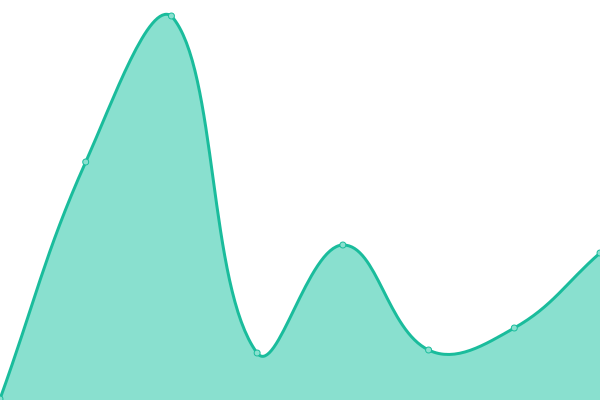
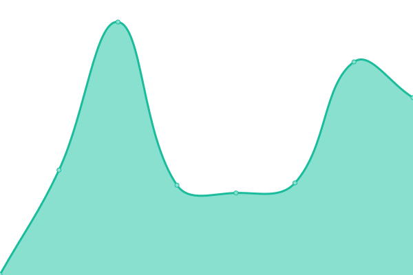
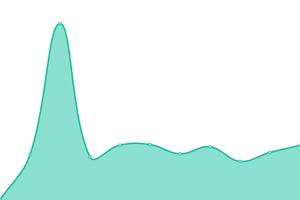
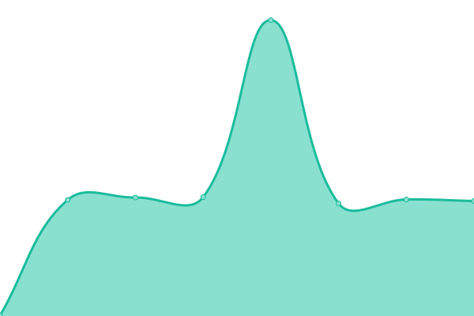
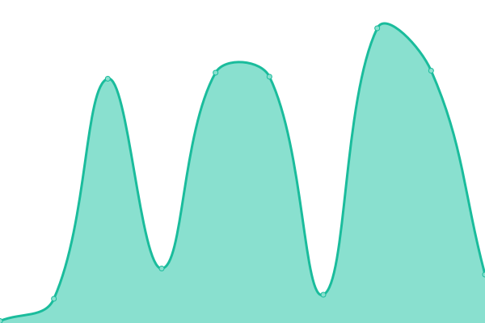
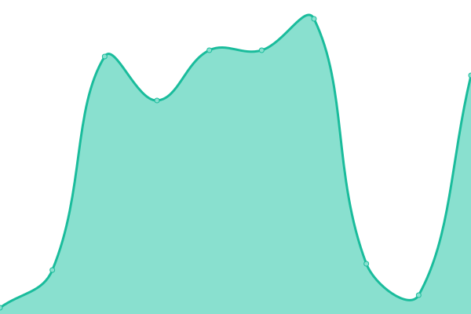
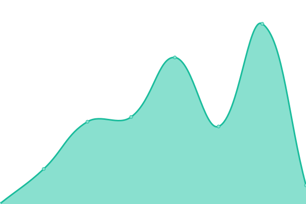
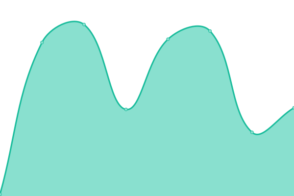

# [📈 Live Status](https://DimensionDev.github.io/Firefly_service_status): <!--live status--> **🟧 Partial outage**

This repository contains the open-source uptime monitor and status page for [Dimension](https://dimension.im), powered by [Upptime](https://github.com/upptime/upptime).

With [Upptime](https://upptime.js.org), you can get your own unlimited and free uptime monitor and status page, powered entirely by a GitHub repository. We use [Issues](https://github.com/DimensionDev/Firefly_service_status/issues) as incident reports, [Actions](https://github.com/DimensionDev/Firefly_service_status/actions) as uptime monitors, and [Pages](https://DimensionDev.github.io/Firefly_service_status) for the status page.

<!--start: status pages-->
<!-- This summary is generated by Upptime (https://github.com/upptime/upptime) -->
<!-- Do not edit this manually, your changes will be overwritten -->
<!-- prettier-ignore -->
| URL | Status | History | Response Time | Uptime |
| --- | ------ | ------- | ------------- | ------ |
|  [Firefly API (prod)](https://api.firefly.land/) | 🟩 Up | [firefly-api-prod.yml](https://github.com/DimensionDev/Firefly_service_status/commits/HEAD/history/firefly-api-prod.yml) | 

 407ms
     
 | 

<a href="https://api-status.firefly.land/history/firefly-api-prod">100.00%</a>
    

|  [Firefly API (dev)](https://api-dev.firefly.land/) | 🟩 Up | [firefly-api-dev.yml](https://github.com/DimensionDev/Firefly_service_status/commits/HEAD/history/firefly-api-dev.yml) | 

 304ms
     
 | 

<a href="https://api-status.firefly.land/history/firefly-api-dev">99.88%</a>
    

|  RSS3 Notes | 🟥 Down | [rss-3-notes.yml](https://github.com/DimensionDev/Firefly_service_status/commits/HEAD/history/rss-3-notes.yml) | 

 0ms
     
 | 

<a href="https://api-status.firefly.land/history/rss-3-notes">0.00%</a>
    

|  RSS3 Profiles | 🟥 Down | [rss-3-profiles.yml](https://github.com/DimensionDev/Firefly_service_status/commits/HEAD/history/rss-3-profiles.yml) | 

 0ms
     
 | 

<a href="https://api-status.firefly.land/history/rss-3-profiles">0.00%</a>
    

|  BlockTracker `get_whale_list` | 🟥 Down | [block-tracker-get-whale-list.yml](https://github.com/DimensionDev/Firefly_service_status/commits/HEAD/history/block-tracker-get-whale-list.yml) | 

 0ms
     
 | 

<a href="https://api-status.firefly.land/history/block-tracker-get-whale-list">0.00%</a>
    

|  BlockTracker `get_whale_feed` | 🟥 Down | [block-tracker-get-whale-feed.yml](https://github.com/DimensionDev/Firefly_service_status/commits/HEAD/history/block-tracker-get-whale-feed.yml) | 

 0ms
     
 | 

<a href="https://api-status.firefly.land/history/block-tracker-get-whale-feed">0.00%</a>
    

|  BlockTracker `get_profile_by_id` | 🟥 Down | [block-tracker-get-profile-by-id.yml](https://github.com/DimensionDev/Firefly_service_status/commits/HEAD/history/block-tracker-get-profile-by-id.yml) | 

 0ms
     
 | 

<a href="https://api-status.firefly.land/history/block-tracker-get-profile-by-id">0.00%</a>
    

|  NFTScan `own/all` | 🟩 Up | [nft-scan-own-all.yml](https://github.com/DimensionDev/Firefly_service_status/commits/HEAD/history/nft-scan-own-all.yml) | 

 6854ms
     
 | 

<a href="https://api-status.firefly.land/history/nft-scan-own-all">99.79%</a>
    

|  NFTScan `filters` | 🟩 Up | [nft-scan-filters.yml](https://github.com/DimensionDev/Firefly_service_status/commits/HEAD/history/nft-scan-filters.yml) | 

 334ms
     
 | 

<a href="https://api-status.firefly.land/history/nft-scan-filters">100.00%</a>
    

|  NFTScan `assets` | 🟩 Up | [nft-scan-assets.yml](https://github.com/DimensionDev/Firefly_service_status/commits/HEAD/history/nft-scan-assets.yml) | 

 340ms
     
 | 

<a href="https://api-status.firefly.land/history/nft-scan-assets">100.00%</a>
    

|  Scheduler Jobs | 🟥 Down | [scheduler-jobs.yml](https://github.com/DimensionDev/Firefly_service_status/commits/HEAD/history/scheduler-jobs.yml) | 

 0ms
     
 | 

<a href="https://api-status.firefly.land/history/scheduler-jobs">0.00%</a>
    

|  CalendarJobs | 🟥 Down | [calendar-jobs.yml](https://github.com/DimensionDev/Firefly_service_status/commits/HEAD/history/calendar-jobs.yml) | 

 0ms
     
 | 

<a href="https://api-status.firefly.land/history/calendar-jobs">0.00%</a>
    

|  MaskStore Service | 🟩 Up | [mask-store-service.yml](https://github.com/DimensionDev/Firefly_service_status/commits/HEAD/history/mask-store-service.yml) | 

 286ms
     
 | 

<a href="https://api-status.firefly.land/history/mask-store-service">100.00%</a>
    

|  MaskNetwork Service | 🟩 Up | [mask-network-service.yml](https://github.com/DimensionDev/Firefly_service_status/commits/HEAD/history/mask-network-service.yml) | 

 406ms
     
 | 

<a href="https://api-status.firefly.land/history/mask-network-service">100.00%</a>
    

|  data-ens-indexer | 🟩 Up | [data-ens-indexer.yml](https://github.com/DimensionDev/Firefly_service_status/commits/HEAD/history/data-ens-indexer.yml) | 

 282ms
     
 | 

<a href="https://api-status.firefly.land/history/data-ens-indexer">100.00%</a>
    

|  data-crypto-event | 🟩 Up | [data-crypto-event.yml](https://github.com/DimensionDev/Firefly_service_status/commits/HEAD/history/data-crypto-event.yml) | 

 89ms
     
 | 

<a href="https://api-status.firefly.land/history/data-crypto-event">100.00%</a>
    

|  msk-connector (prod) | 🟩 Up | [msk-connector-prod.yml](https://github.com/DimensionDev/Firefly_service_status/commits/HEAD/history/msk-connector-prod.yml) | 

 5259ms
     
 | 

<a href="https://api-status.firefly.land/history/msk-connector-prod">100.00%</a>
    

|  glue-jobs (prod) | 🟥 Down | [glue-jobs-prod.yml](https://github.com/DimensionDev/Firefly_service_status/commits/HEAD/history/glue-jobs-prod.yml) | 

 578ms
     
 | 

<a href="https://api-status.firefly.land/history/glue-jobs-prod">0.00%</a>
    

|  msk-connector (dev) | 🟩 Up | [msk-connector-dev.yml](https://github.com/DimensionDev/Firefly_service_status/commits/HEAD/history/msk-connector-dev.yml) | 

 4014ms
     
 | 

<a href="https://api-status.firefly.land/history/msk-connector-dev">100.00%</a>
    

|  glue-jobs (dev) | 🟩 Up | [glue-jobs-dev.yml](https://github.com/DimensionDev/Firefly_service_status/commits/HEAD/history/glue-jobs-dev.yml) | 

 878ms
     
 | 

<a href="https://api-status.firefly.land/history/glue-jobs-dev">99.79%</a>
    

|  mirror | 🟥 Down | [mirror.yml](https://github.com/DimensionDev/Firefly_service_status/commits/HEAD/history/mirror.yml) | 

 63ms
     
 | 

<a href="https://api-status.firefly.land/history/mirror">98.82%</a>
    

<!--end: status pages-->

[**Visit our status website →**](https://DimensionDev.github.io/Firefly_service_status)

## 📄 License

- Powered by: [Upptime](https://github.com/upptime/upptime)
- Code: [MIT](./LICENSE) © [Dimension](https://dimension.im)
- Data in the `./history` directory: [Open Database License](https://opendatacommons.org/licenses/odbl/1-0/)
